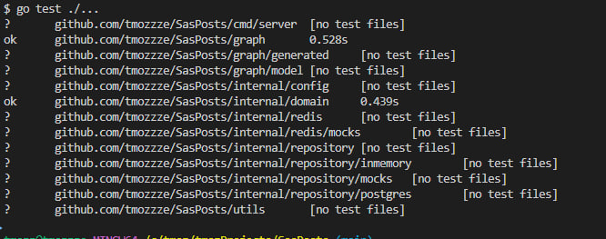

**Технологии:**
- gqlgen, PostgreSQL, pgx, Redis, Docker и Docker Compose, testify и mockery

**Функционал:**
1. Создание и просмотр постов
2. Возможность запретить комментирование для конкретного поста
3. Создание иерархических комментариев
4. Пагинация для списков комментариев
5. Подписки на новые комментарии к посту

**ЗАПУСК**

В терминале:
- docker-compose up -d

Другой терминал:
- go run cmd/server/main.go

    по дефолту запускается хранилище PostgreSQL

    *или для in-memory:*

- DB_TYPE=inmemory \ go run cmd/server/main.go

Для API

После запуска приложения. В браузере
- localhost:8080

Для запуска юнит-тестов
- go test ./...

Результаты Юнит тестов

